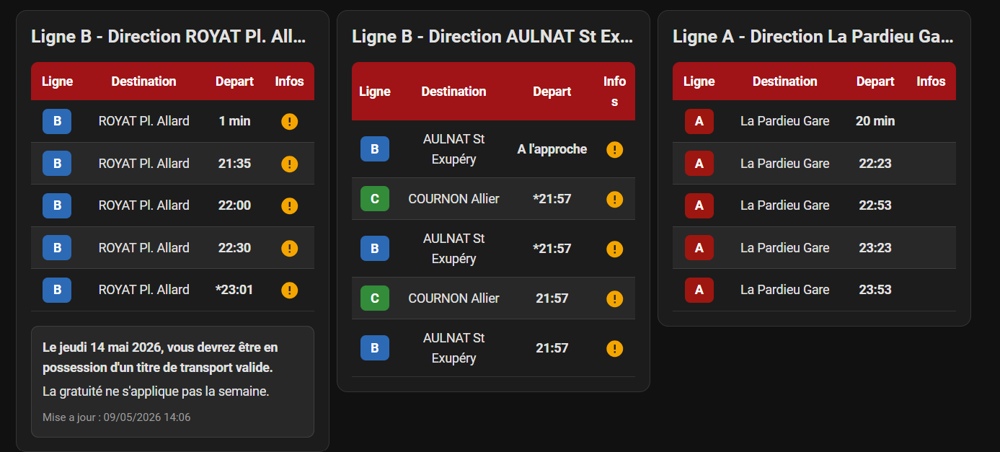

# T2C Clermont-Ferrand Card


Carte Lovelace pour Home Assistant permettant d'afficher les prochains passages exposés par l'integration `t2c_clermontferrand`.



## Fonctionnalites

- Selection de l'arret depuis l'editeur visuel Home Assistant.
- Affichage automatique des prochains passages a partir de l'entite `passage_1`.
- Pastilles de ligne colorees avec les attributs `route_color` et `route_text_color`.
- Colonne `Infos` vide par defaut, avec une icone d'alerte quand `has_alert` vaut `true`.
- Bloc de detail au clic ou au tap sur l'icone, compatible desktop et mobile.
- Bloc optionnel pour afficher l'information generale du reseau.
- Compatible installation HACS en categorie `Dashboard`.

## Installation avec HACS

1. Dans HACS, ajouter ce depot comme depot personnalise.
2. Choisir la categorie `Dashboard`.
3. Installer `T2C Clermont-Ferrand Card`.
4. Verifier que la ressource est de type `Module JavaScript`.
5. Vider le cache du navigateur si la carte n'apparait pas tout de suite.

Ressource attendue :

```text
/hacsfiles/T2C-Clermont-Ferrand-Card/t2c_clermont-ferrand_card.js
```

## Utilisation

Depuis l'editeur de dashboard Home Assistant :

1. Ajouter une nouvelle carte.
2. Choisir `T2C Clermont-Ferrand Card`.
3. Selectionner l'arret a afficher dans la liste.
4. Ajuster le titre, le nombre de passages et l'affichage de l'information reseau si besoin.

Configuration YAML minimale :

```yaml
type: custom:t2c-clermontferrand-card
entity: sensor.ligne_b_direction_royat_pl_allard_arret_les_chapelles_passage_1
```

Configuration complete :

```yaml
type: custom:t2c-clermontferrand-card
entity: sensor.ligne_b_direction_royat_pl_allard_arret_les_chapelles_passage_1
title: Les Chapelles
passages: 5
show_network_info: true
```

## Options

| Option | Obligatoire | Defaut | Description |
| --- | --- | --- | --- |
| `entity` | Oui |  | Entite `passage_1` de l'arret a afficher. |
| `title` | Non | Nom de l'entite | Titre affiche en haut de la carte. |
| `passages` | Non | `5` | Nombre de passages a afficher, entre 1 et 10. |
| `show_network_info` | Non | `false` | Affiche le bloc d'information generale du reseau si l'entite est detectee. |

## Convention d'entites

La carte se configure avec l'entite `passage_1` d'un arret. Elle reconstruit ensuite les autres passages avec le meme prefixe :

```text
sensor.ligne_X_direction_YYY_arret_ZZZ_passage_1
sensor.ligne_X_direction_YYY_arret_ZZZ_passage_2
sensor.ligne_X_direction_YYY_arret_ZZZ_passage_3
sensor.ligne_X_direction_YYY_arret_ZZZ_passage_4
sensor.ligne_X_direction_YYY_arret_ZZZ_passage_5
```

Exemple :

```yaml
type: custom:t2c-clermontferrand-card
entity: sensor.ligne_b_direction_royat_pl_allard_arret_les_chapelles_passage_1
```

## Attributs de passage

Chaque capteur de passage peut contenir les attributs suivants :

```yaml
destination: ROYAT Pl. Allard
line: B
route_id: B
route_color: "#0069b4"
route_text_color: "#ffffff"
has_alert: true
alert_icon: mdi:alert-circle
alert_title: J. Mermoz reportes
alert_text: En raison de travaux, les arrets J. Mermoz seront reportes.
updated_at: "2026-04-27T10:08:33"
```

L'etat du capteur est utilise comme horaire ou temps d'attente.

Les noms d'attributs sont lus de facon souple. Les variantes comme `Route ID`, `Route color`, `Route text color`, `Has alert`, `Alert icon`, `Alert title`, `Alert text` et `Updated at` sont prises en charge.

## Alertes

La colonne `Infos` reste vide quand il n'y a pas d'alerte.

Si `has_alert` vaut `true`, la carte affiche l'icone indiquee par `alert_icon`. Cliquer ou appuyer sur l'icone affiche un bloc de detail sous le tableau, compatible desktop et mobile :

```text
...
...
Mise a jour : ...
```

## Information reseau

L'option `show_network_info` affiche un bloc d'information generale du reseau sous le tableau.

La carte tente de detecter automatiquement une entite dont l'identifiant ou le nom contient :

```text
informations_reseau
network_info
Informations reseau
```

Les attributs reconnus pour ce bloc sont notamment :

```yaml
title: Information reseau
text: Le jeudi 14 mai 2026, vous devrez etre en possession d'un titre de transport valide.
updated_at: "2026-05-09T14:06:00"
```

Les variantes `info`, `message`, `description`, `Alert title`, `Alert text` et `Updated at` sont aussi prises en charge.

Si aucun attribut de texte n'est fourni, l'etat du capteur est utilise comme message, sauf pour les etats techniques comme `unknown` ou `unavailable`.

## Diagnostic

Si Home Assistant affiche `Custom element doesn't exist: t2c-clermontferrand-card`, ouvrir la console du navigateur sur le dashboard et executer :

```js
customElements.get("t2c-clermontferrand-card")
window.t2cClermontFerrandCardVersion
```

Le premier appel doit retourner une classe JavaScript et le second doit retourner la version chargee de la carte.

Si les deux valeurs sont `undefined`, Home Assistant n'a pas encore charge la ressource. Verifier le chemin, le type `Module JavaScript`, puis vider le cache du navigateur.
